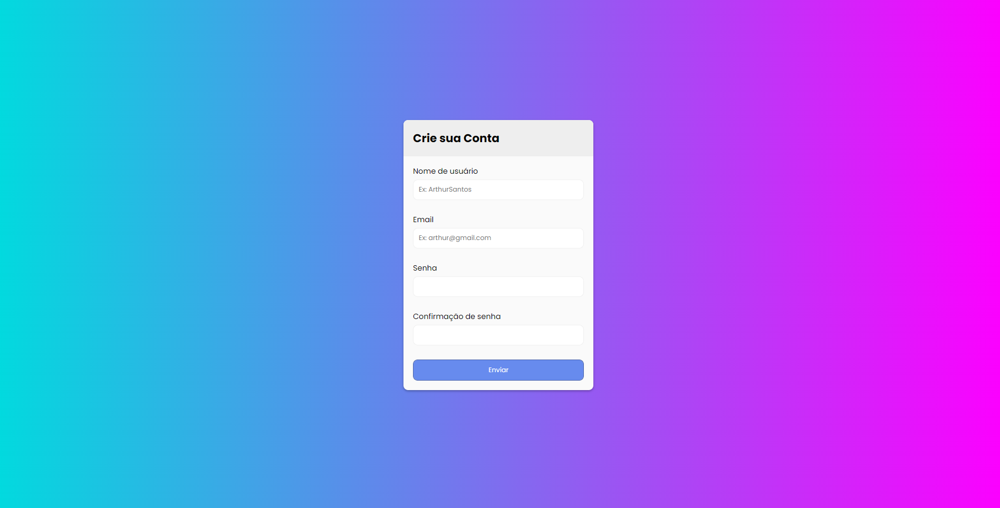

<h1 align="center"> Formulário</h1>

  <a href="#memo-licença">Licença</a>

  

 

  

## 🚀 Tecnologias

Esse projeto foi desenvolvido com as seguintes tecnologias:

- HTML e CSS
- JavaScript
- Git e Github

## 💻 Projeto

Formulário com validação de senha, e-mail e usuário.

## :memo: Licença

Esse projeto está sob a licença MIT.

---
